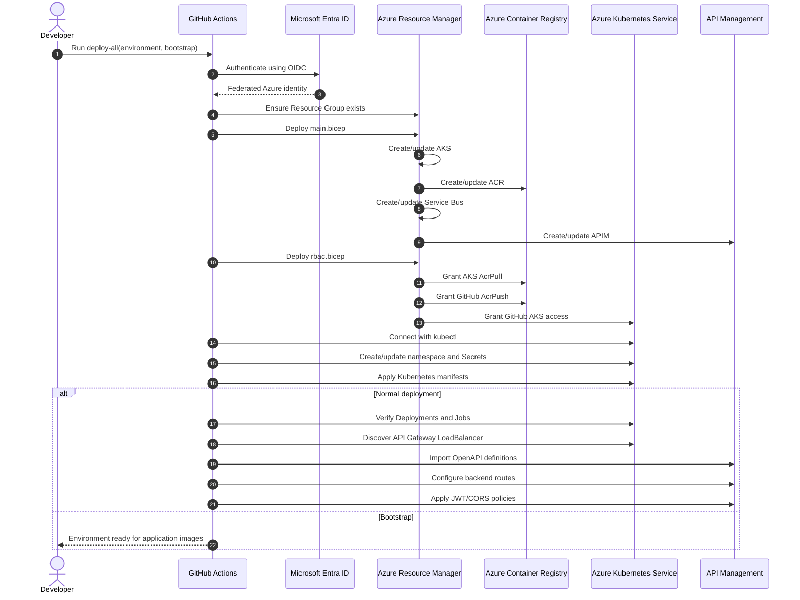
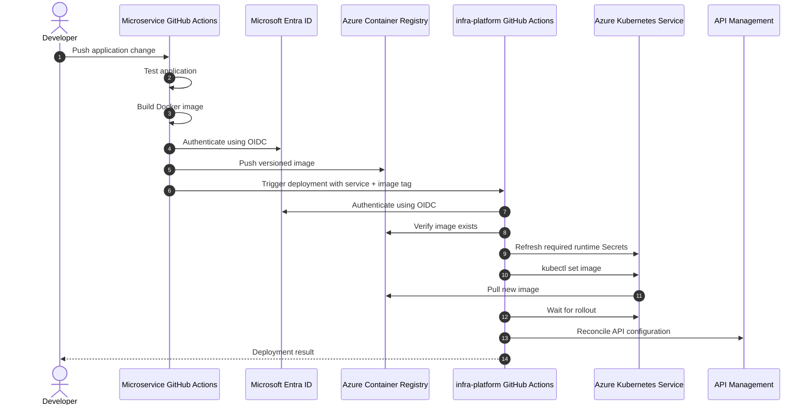

# CommerceFabric Deployment Flow

CommerceFabric uses separate workflows for **platform creation** and **application releases**.

At a high level, Bicep describes what Azure should contain, Kubernetes manifests describe what AKS should run, and GitHub Actions coordinates the deployment process.

---

## Components

| Component | Responsibility |
|---|---|
| `main.bicep` | Creates/updates AKS, ACR, Service Bus and APIM. |
| `.bicepparam` | Supplies production/test environment values. |
| `rbac.bicep` | Connects Azure identities and resources through RBAC. |
| Kubernetes manifests | Define workloads, Services and Jobs running in AKS. |
| Swagger/OpenAPI files | Define the public Orders, Products and Users API contracts. |
| `api-policy.xml` | Defines shared APIM policies such as JWT validation and CORS. |
| `configure-apim.ps1` | Discovers the API Gateway and configures APIM from the API definitions/policies. |
| `deploy-all.yml` | Creates/reconciles an entire environment. |
| `deploy-microservice.yml` | Releases one application image into an existing environment. |
| Microservice CI | Tests, builds and publishes application images. |

---

# Full Environment Sequence



---

# Microservice Release Sequence



---

# Azure Architecture

```mermaid
flowchart LR

    %% =========================================================
    %% External actors / services
    %% =========================================================

    Client["Client / Frontend"]
    Entra["Microsoft Entra<br/>External ID"]

    %% =========================================================
    %% Azure
    %% =========================================================

    subgraph Azure["Azure Resource Group"]

        APIM["Azure API Management"]
        ACR["Azure Container Registry"]

        %% -----------------------------------------------------
        %% AKS
        %% -----------------------------------------------------

        subgraph AKS["Azure Kubernetes Service"]

            subgraph NS["commercefabric-namespace"]

                Gateway["API Gateway"]

                subgraph Services["Microservices"]
                    Orders["Orders"]
                    Products["Products"]
                    Users["Users"]
                end

                subgraph Stores["Data & Supporting Services"]
                    Mongo[("MongoDB")]
                    MySQL[("MySQL")]
                    Postgres[("PostgreSQL")]
                    Redis[("Redis")]
                    Rabbit["RabbitMQ"]
                end

                %% Gateway routes
                Gateway --> Orders
                Gateway --> Products
                Gateway --> Users

                %% Orders dependencies
                Orders --> Mongo
                Orders --> Redis
                Orders --> Rabbit

                %% Products dependencies
                Products --> MySQL
                Products --> Rabbit

                %% Users dependencies
                Users --> Postgres
            end
        end

        %% -----------------------------------------------------
        %% Messaging
        %% -----------------------------------------------------

        subgraph ServiceBus["Azure Service Bus"]
            Topics["Topics"]
            Subs["Subscriptions"]

            Topics --> Subs
        end
    end

    %% =========================================================
    %% CI / CD
    %% =========================================================

    subgraph CICD["CI / CD"]
        direction TB
        GitHub["GitHub Actions"]
    end

    %% =========================================================
    %% Primary request flow
    %% =========================================================

    Client -->|"HTTPS"| APIM
    APIM -->|"API requests"| Gateway

    %% =========================================================
    %% Authentication
    %% =========================================================

    Client -->|"Sign in"| Entra
    Entra -.->|"JWT"| Client
    APIM -.->|"Validate token"| Entra

    %% =========================================================
    %% Async integration
    %% =========================================================

    Orders <-->|"Events"| ServiceBus
    Products <-->|"Events"| ServiceBus

    %% =========================================================
    %% Container delivery
    %% =========================================================

    ACR -->|"Pull images"| AKS

    %% =========================================================
    %% CI / CD
    %% =========================================================

    GitHub -.->|"OIDC + Bicep"| Azure
    GitHub -->|"Push images"| ACR
    GitHub -.->|"Deploy workloads"| AKS

    %% =========================================================
    %% Layout helper
    %% =========================================================

    Azure ~~~ CICD

    %% =========================================================
    %% Node Styling
    %% =========================================================

    classDef external fill:#f7f7f7,stroke:#555,stroke-width:1px;
    classDef edge fill:#e8f2ff,stroke:#0078d4,stroke-width:2px;
    classDef service fill:#ffffff,stroke:#555,stroke-width:1px;
    classDef data fill:#fff4df,stroke:#b7791f,stroke-width:1px;
    classDef cicd fill:#f3e8ff,stroke:#805ad5,stroke-width:1px;

    %% Microservice colours
    classDef orders fill:#fce4ec,stroke:#d81b60,stroke-width:1px,color:#880e4f;
    classDef products fill:#e8f5e9,stroke:#2e7d32,stroke-width:1px,color:#1b5e20;
    classDef users fill:#fff3e0,stroke:#ef6c00,stroke-width:1px,color:#e65100;

    class Client,Entra external;
    class APIM,Gateway edge;
    class Topics,Subs,Rabbit service;
    class Mongo,MySQL,Postgres,Redis data;
    class GitHub,ACR cicd;

    class Orders orders;
    class Products products;
    class Users users;

    %% =========================================================
    %% Link Styling
    %% =========================================================

    %% Link numbers are based on declaration order above.

    %% Gateway -> Orders
    linkStyle 0 stroke:#d81b60,stroke-width:1px;

    %% Gateway -> Products
    linkStyle 1 stroke:#2e7d32,stroke-width:1px;

    %% Gateway -> Users
    linkStyle 2 stroke:#ef6c00,stroke-width:1px;

    %% Orders -> Mongo / Redis / RabbitMQ
    linkStyle 3,4,5 stroke:#d81b60,stroke-width:1px;

    %% Products -> MySQL / RabbitMQ
    linkStyle 6,7 stroke:#2e7d32,stroke-width:1px;

    %% Users -> PostgreSQL
    linkStyle 8 stroke:#ef6c00,stroke-width:1px;

    %% Orders <-> Service Bus
    linkStyle 15 stroke:#d81b60,stroke-width:1px;

    %% Products <-> Service Bus
    linkStyle 16 stroke:#2e7d32,stroke-width:1px;
```



---

# End-to-End Model

The complete release model is therefore:

```text
Infrastructure change
      │
      ▼
infra-platform
      │
      ▼
Bicep
      │
      ▼
Azure resources / RBAC
      │
      ▼
Kubernetes manifests
      │
      ▼
AKS


Application change
      │
      ▼
Microservice CI
      │
      ▼
Docker image
      │
      ▼
ACR
      │
      ▼
infra-platform
      │
      ▼
AKS rolling deployment


Public API configuration
      │
      ├── Swagger/OpenAPI
      ├── API policy XML
      └── configure-apim.ps1
              │
              ▼
             APIM
              │
              ▼
         API Gateway on AKS
              │
              ▼
         Microservices on AKS
```

The result is a platform where **infrastructure, deployment configuration and public API configuration are reproducible from source control**, while application repositories can release independently.
